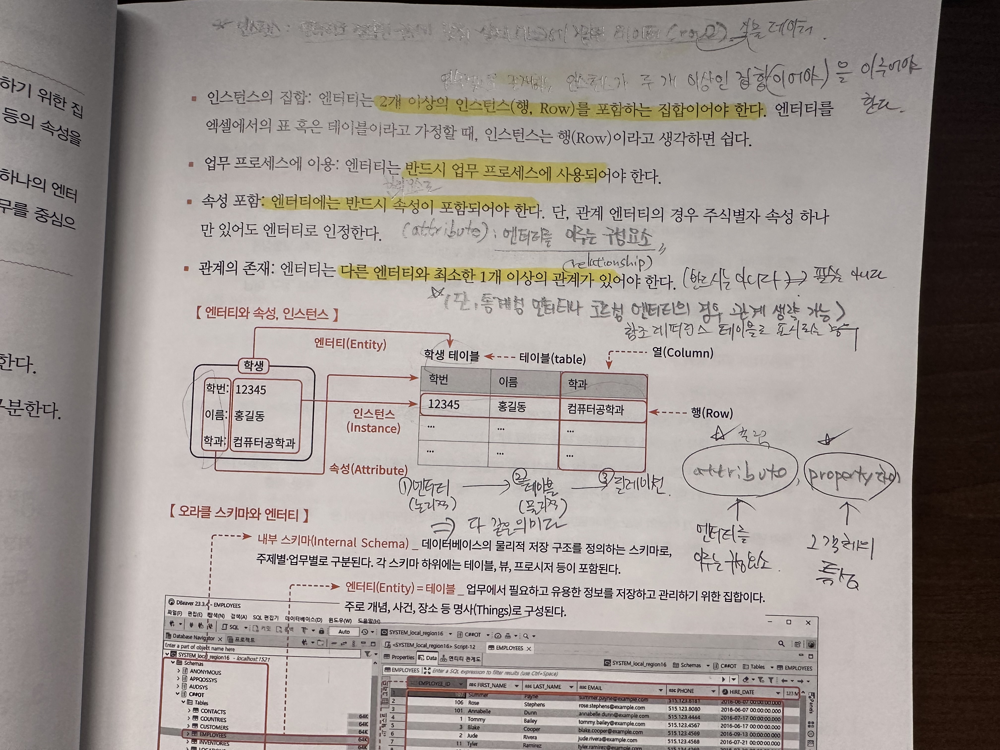
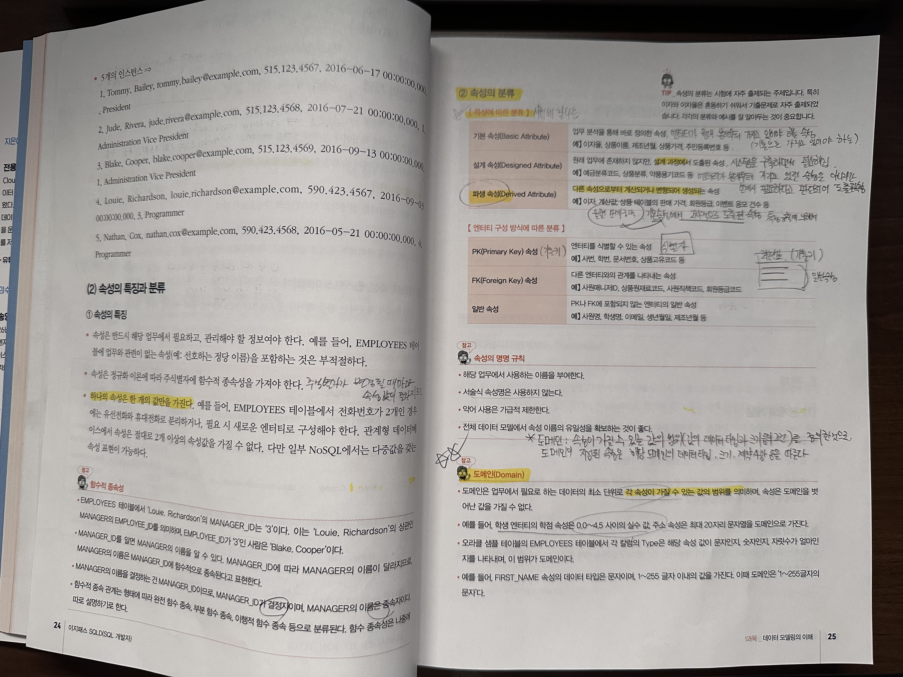

## 엔터티의 정의

- 데이터베이스의 구성요소 중 독립적으로 식별가능한 객체(대상)
- 업무에 필요하고 유용한 정보를 저장하고 관리하기 위한 집합적인 실체 또는 객체

## 엔터티의 특징

- 반드시 업무에서 필요하고 관리할 가치가 있는 정보여야 한다. (최소한의 정보로 구성)

- 엔터티는 식별이 가능하도록 유일한 식별자를 가져야 한다. (e.g. 사번, 학번 등)

- 영속적으로 존재하는 인스턴스가 두 개 이상인 집합을 이루어야 한다.
  - 인스턴스 : 엔터티로 정의된 구조에 맞춰 실제 디스크에 저장된 데이터
- 반드시 업무 프로세스에 사용되어야 한다.

- 반드시 엔터티의 하위 요소로 속성이 포함되어야 한다. (속성, attribute, 엔터티를 이루는 기본 요소)

- 엔터티는 다른 엔터티와 최소한 1개 이상의 관계가 있어야 한다.
  - 단, 통계성 엔터티와 코드성 엔터티의 경우 관계 생략이 가능하다

## 속성을 부르는 두 영어 단어

- attribute : 엔터티를 이루는 구성 요소
- property : 그 객체의 특성

## 인스턴스

엔터티로 정의된 구조에 맞춰 실제 디스크에 저장된 데이터

## 엔터티, 테이블, Relation

셋 다 같은 말이나 엔터티는 논리적 데이터 모델링에서 쓰는 용어
테이블은 물리적 데이터 모델링에서 쓰는 용어

## 속성의 개념, 정의

- 엔터티의 하위요소로, 엔터티에 대한 자세하고 구체적인 정보를 나타낸 것
- 의미상으로 분리되지 않는 최소의 데이터 단위 (Atomic)
- 속성의 개수에는 제한이 없지만, 처리하고자 하는 업무 프로세스에 꼭 필요한 것 위주로 최소화 필요

## 속성값

- 속성이 가질 수 있는 특정값
- 하나의 엔터티 인스턴스에서 각각의 속성은 하나의 속성값만을 지님

## 엔터티, 속성, 인스턴스

- 한 개의 엔터티는 두 개 이상의 인스턴스를 가진다. (인스턴스의 집합)
- 한 개의 엔터티는 두 개 이상의 속성을 가진다.
- 한 개의 속성은 한 개의 속성값을 가진다.
- 속성은 정규화 이론에 따라 주식별자에 함수적 종속성을 가져야 한다.
  - 주식별자가 변경될 때마다 속성값도 달라짐 : 함수적 종속성을 가짐 (결정자와 종속자)

## 속성의 분류

### 특성에 따른 분류 (시험에 잘나옴)

#### 기본 속성 (Basic Attribute)

- 엔터티가 원래 본래부터 가지고 있어야 하는 속성
- 엔터티가 만들어지면서부터 기본으로 가지고 있을 법한 속성
- 업무 분석을 통해 바로 정의가 가능한 속성이기도 함

#### 설계 속성 (Designed Attribute)

- 원래 존재하는 속성은 아니였지만 시스템을 구축하면서 설계하면서 필요하게 되어 도출된 속성
- 엔터티가 본래부터 가지고 있던 속성은 아니지만 설계시 필요하다고 판단되어짐

#### 파생 속성 (Derived Attribute)

- 다른 속성으로부터 계산되거나 변형되어 생성되는 속성
- 기본 속성에서 2차적으로 도출된 속성 (특정 규칙에 의해서)

### 엔터티 구성 방식에 따른 분류

- PK (Primary Key) 속성
- FK (Foreign Key) 속성
- 일반 속성

## 도메인 (Domain)

- 속성이 가질 수 있는 값의 범위 (값의 데이터 타입과 크기 등의 조건) 를 정의한 것
- 도메인이 지정된 속성은 해당 도메인의 데이터 타입, 크기, 제약사항 등을 따른다.
